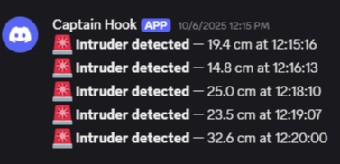
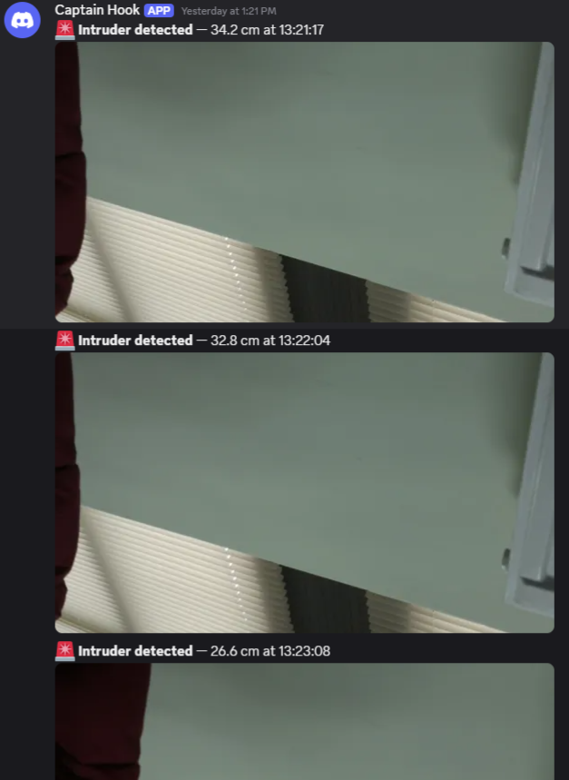
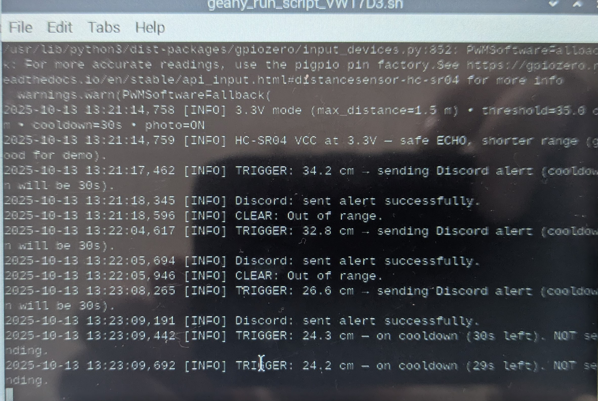
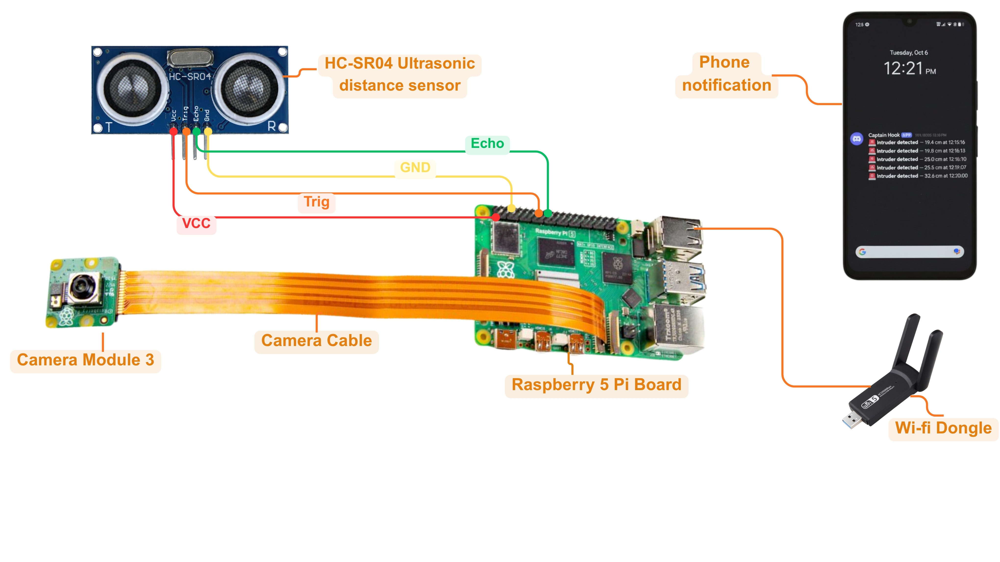
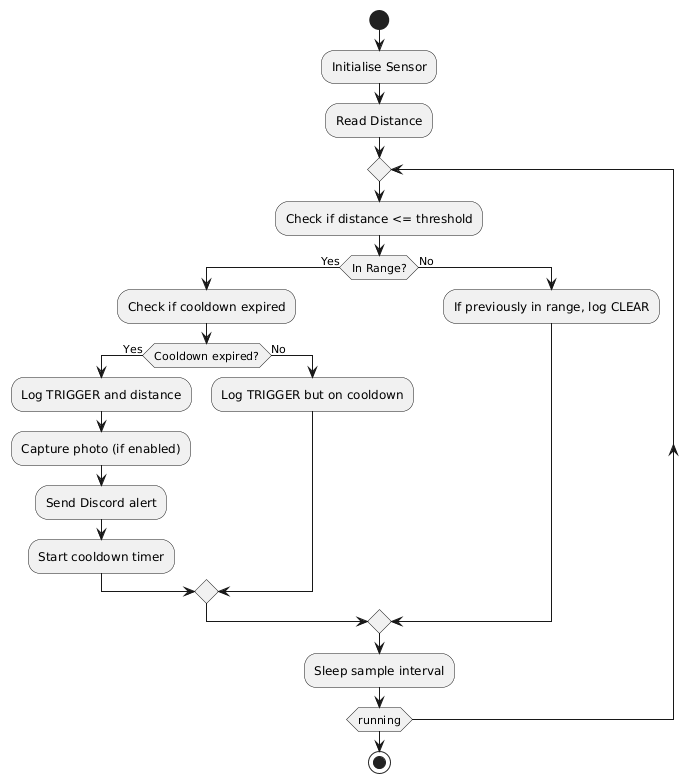

# 🎯 Intruder Alert — Raspberry Pi 5 (HC-SR04 + Camera Module 3)

Short-range intruder detection using an HC-SR04 ultrasonic sensor and optional Camera Module 3. Sends alerts to Discord, with an optional snapshot. Safe for classroom demos: HC-SR04 runs at 3.3 V (no level shifter needed). Configurable via environment variables.

✅ Raspberry Pi OS Bookworm  
✅ Prefers lgpio backend on Pi 5 (auto-fallback)  
✅ Event-driven alerts with cooldown (no spam)

## 👀 Demo

| Trigger with image | Text-only mode |
|-------------------|----------------|
|  |  |

**Runtime logs during a demo:**



## 🧱 Architecture & Flow

**High-level diagram**



**Control flow**



## ✨ Features

- **Threshold-based detection** (default 35 cm)
- **Cooldown window** (default 30 s) to avoid spam
- **Optional photo capture** (attached to Discord alert)
- **Clear logs**: TRIGGER → send, TRIGGER → cooldown, CLEAR
- **All settings via env vars** (no code edits)

## 🔌 Hardware

- Raspberry Pi 5
- HC-SR04 ultrasonic distance sensor
- Camera Module 3 (IMX708) + 22↔15 ribbon adapter (optional)
- Jumper wires (M→F)

### Wiring (as built)

| Pi Physical Pin | BCM | Connect To | Purpose |
|----------------|-----|------------|---------|
| Pin 1 (3.3 V) | — | HC-SR04 VCC | Safe power |
| Pin 6 (GND) | — | HC-SR04 GND | Ground |
| Pin 16 | 23 | TRIG | Trigger pulse |
| Pin 18 | 24 | ECHO | Echo return |
| CAM0 port | — | Camera ribbon | Camera Module 3 |

**Safety:** HC-SR04 powered at 3.3 V keeps the ECHO line in spec for GPIO.

## 🧰 Software Requirements

Install on the Pi (Bookworm):

```bash
sudo apt update
sudo apt install -y python3-gpiozero python3-requests libcamera-apps fswebcam
```

Python deps (also in `requirements.txt`):

```txt
gpiozero
requests
```

## 🚀 Quick Start

```bash
# 1) Clone
git clone https://github.com/NicSterian/intruder-alert-pi5.git
cd intruder-alert-pi5

# 2) Configure (don't commit your secrets)
cp .env.example .env
nano .env    # paste your real WEBHOOK_URL

# 3) (Optional) camera sanity check
rpicam-still -n -t 500 --immediate -o /tmp/test.jpg && ls -lh /tmp/test.jpg

# 4) Run
python3 src/intruder_alert.py
```

## ⚙️ Configuration (env vars)

Edit `.env` or prefix your run command.

| Variable | Default | Description |
|----------|---------|-------------|
| `WEBHOOK_URL` | (required) | Discord webhook URL |
| `SEND_PHOTO` | `1` | `1` attach photo, `0` text-only |
| `INTRUDER_THRESHOLD_CM` | `35` | Trigger distance (cm) |
| `INTRUDER_COOLDOWN` | `30` | Cooldown (seconds) |
| `INTRUDER_SAMPLE_S` | `0.25` | Polling interval (seconds) |

### Examples

```bash
# Quiet run without photos
SEND_PHOTO=0 python3 src/intruder_alert.py

# More sensitive & faster notifications
INTRUDER_THRESHOLD_CM=60 INTRUDER_COOLDOWN=10 python3 src/intruder_alert.py
```

## 🧠 How It Works

1. **Backend select** → prefers lgpio (Pi 5), falls back to pigpio/default
2. **Read distance** → compare to threshold
3. **Cooldown gate** → log if on cooldown, else proceed
4. **Capture (optional)** → rpicam-still snapshot
5. **Send** → Discord webhook (text or multipart with image)

**Key log lines:**

```
TRIGGER: 32.8 cm → sending Discord alert
TRIGGER: 24.3 cm — on cooldown (29s left). NOT sending.
CLEAR: Out of range.
```

## 🧪 Testing Checklist

- [ ] **Threshold:** < 35 cm triggers; > 35 cm does not
- [ ] **Cooldown:** only one alert in the window
- [ ] **Photo ON:** image attached when camera present
- [ ] **Photo ON + camera unplugged:** text-only fallback
- [ ] **Latency:** alert visible in Discord within a few seconds

## 🛠 Troubleshooting

### "No cameras available"
Check ribbon orientation; list cameras: `rpicam-hello --list-cameras`. Ensure `libcamera-apps` is installed.

### VS Code (Windows) shows "gpiozero not found"
Normal. The code runs on the Pi. Install `gpiozero` on the Pi.

### No alerts
Verify `WEBHOOK_URL` in `.env`. Quick webhook test:

```bash
curl -H "Content-Type: application/json" -d '{"content":"hello"}' "$WEBHOOK_URL"
```

### Noisy readings
Increase `INTRUDER_SAMPLE_S` or threshold. Consider raising `queue_len` in code for more smoothing.

## 📁 Repository Layout

```
intruder-alert-pi5/
├─ src/
│  └─ intruder_alert.py
├─ docs/
│  ├─ design/Design_Document_Nicolae_Sterian.docx
│  ├─ implementation/Implementation_Testing_Report_Nicolae_Sterian.docx
│  └─ images/ (flowchart, wiring, code snippets, screenshots)
├─ .env.example
├─ .gitignore
├─ .gitattributes
├─ requirements.txt
├─ README.md
└─ LICENSE
```

## 🔒 Security Notes

- Never commit a real `.env` or webhook URL.
- Rotate your Discord webhook if it ever leaks.

## 📜 License

MIT — see [LICENSE](LICENSE).

## 🙌 Acknowledgements

- Raspberry Pi OS Bookworm camera stack
- gpiozero maintainers
- Discord webhook API

## ⚡ Bonus: run on boot (systemd)

Create `/etc/systemd/system/intruder-alert.service`:

```ini
[Unit]
Description=Intruder Alert (HC-SR04 + Camera) on Raspberry Pi 5
After=network-online.target

[Service]
Type=simple
User=pi
WorkingDirectory=/home/pi/intruder-alert-pi5
EnvironmentFile=/home/pi/intruder-alert-pi5/.env
ExecStart=/usr/bin/python3 /home/pi/intruder-alert-pi5/src/intruder_alert.py
Restart=on-failure

[Install]
WantedBy=multi-user.target
```

Enable it:

```bash
sudo systemctl daemon-reload
sudo systemctl enable --now intruder-alert.service
sudo systemctl status intruder-alert.service
```
